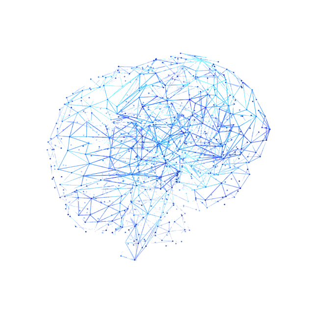
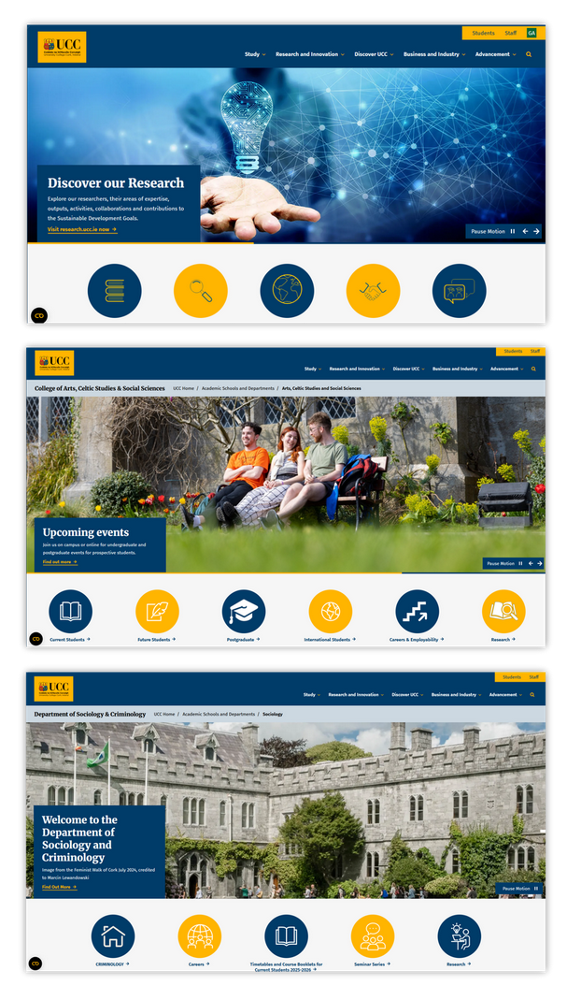

# AI and the Future of the UCC Website
Dr. Kara Hosford

<!--

Good afternoon, and thank you for having me. I really appreciate the panel's flexibility in rescheduling today’s interview; as co-chair for LGBTI+ Awareness Week, I've had several fixed commitments, so thank you for accommodating the move.

My name is Kara Hosford, and today I’m discussing the evolving role of AI for the university website. Since 'AI' is such a broad term, I want to start by grounding our discussion in a specific context and define exactly what I mean, and what I don't mean when discussing Ai.

-->

---

# Understanding AI Usage Context

### AI is viewed as an enabling tool
The public generally accepts AI-generated media as a pragmatic solution for grassroots organizations to produce high volumes of advocacy content on limited budgets (Dey, 2023).

### UCC's international reach requires a nuanced approach
Cultural values shape trust and adoption, meaning AI integration faces varying levels of acceptance or resistance depending on regional context (AbuDaabes, 2025).

<!--

To be clear, when I talk about AI today, I’m not looking at it as a tool for generating data. We know that professional AI use is still a bit of a contested topic, but the context really matters. In the NGO and advocacy space, for example, it’s rarely seen as a threat to jobs; it’s seen as a way to amplify reach.

For an institution like UCC, we have to be even more thoughtful about cultural values and trust. I want to lean into the idea that AI isn't here to replace our creativity—it's here to handle the heavy lifting. That’s my focus today: how AI can help us manage the website workload and, more importantly, make the site a more accessible and inclusive place for sharing knowledge
-->

---

# Current Challenges

Website users can struggle to find the right information quickly and confidently.

**Key barriers on the current site:**
- Accessibility gaps (WCAG 2.1 AA): missing alt text, uncaptioned videos, inaccessible documents
- Important content spread across disconnected pages and sections
- High effort required to move from general interest to the exact answer a user needs

<!--

Over the years the existing website has amassed a vast amount of content—from courses and modules to support services and event media. This has led to 'infobesity,' where users are overwhelmed by an oversaturation of data. 

As we add new systems to streamline the site, legacy information is often left behind, making it increasingly difficult for users to distinguish between what is relevant and what is outdated

-->

---

# Current Challenges: *Why This Persists*

- Page publishers are operating under **time pressure** and competing priorities
- Legacy structures were built for **publishing pages**, not for answering user intent
- Navigation remains **hierarchy-first**, while user behavior is increasingly question-first
- As a result, users must **manually connect** information that should already be connected

<!--

We all have a good understanding of why these issues persist. There’s constant time pressure on school and departmental administrators who are already juggling multiple tasks.

Beyond that, websites are traditionally designed to publish pages rather than answer specific questions. While F A Qs are useful, they’re limited and require constant oversight to stay relevant. 

But also we have to recognize that younger users today expect immediate answers—they aren't as willing to spend time manually connecting the dots as we might have been in the past

-->

---

# From Structure to Discovery: AI Search for UCC

The current site is like an onion: a series of silos that forces users to peel through multiple layers to find what they need.

In contrast, The intent-based experience should be a 'starburst.' By using AI-driven metadata and relationship mapping, we can surface connected answers instantly. This moves us toward a dynamic, intent-based experience where natural-language queries provide a direct pathway to relevant content."

<!--

So, what are we really looking at here?

The current site is like an onion—it’s full of layers, and users have to peel through them to find what they need. Some layers are useful, others are outdated, but the effort remains high.

- Case example of similar looking layers

Increasingly, users are beginning to expect a 'starburst' or knowledge graph style site that instantly connects and surfaces exactly what the user is looking for. But what does that actually look like in practice?

-->

---

<!-- _paginate: false -->

<iframe
	id="ck113-sim-frame"
	src="about:blank"
	data-src="./html/sim.html"
	loading="lazy"
	title="CK113 AI search simulation"
	class="sim-embed"
></iframe>

<!--

Imagine an interface that’s familiar and accessible—one that doesn't just list results but actively guides the user to exactly what they need. It’s an AI-powered search providing answers that are contextually relevant, yet carefully curated.

The thing is, the knowledge and data are already there; the website works fine. Our challenge is simply making all that information accessible. We aren’t trying to reinvent the wheel—the car is already in motion. We’re just giving the driver Google Maps to help them navigate.

But as flashy as this demo looks, it's important to recognize that a transition like this won't happen overnight

-->

---

# Ai isn't the Bandaid Soloution

1. **Maintain HTML-first publishing** across units, with accessible Word/PDF only where necessary
2. **Apply consistent metadata and taxonomy** so pages are discoverable, linkable, and interpretable
3. **Embed accessibility standards in authoring**: headings, lists, tables, alt text, captions/transcripts, and plain language
4. **Support moderators through training and guidance** so standards are applied consistently in day-to-day publishing
5. **Review and improve continuously** to strengthen quality, compliance, and search reliability over time

<!--

The truth is, AI only works if the content itself is designed to support it. That means staying committed to HTML-first publishing and using consistent metadata. 

By embedding accessibility standards—like clear headings, alt-text, and plain language—directly into our daily editorial workflow.

-->

---

# What This Means for the Web Content Editor Role

- **Operationalize standards:** turn accessibility and content rules into repeatable editorial workflows
- **Use AI with oversight:** apply AI to support tasks (alt text suggestions, transcript workflows, readability checks) with human sign-off
- **Improve discoverability:** strengthen metadata quality, internal linking, and taxonomy consistency across content types
- **Enable inclusive reach:** support multilingual and plain-language content for diverse audiences
- **Protect quality and brand:** maintain institutional voice, editorial accuracy, and governance accountability

<!--

I see the role as turning abstract policies into practical, repeatable workflows. 

In this model, AI handles the repetitive heavy lifting—like drafting alt-text or transcribing media—but always with a human sign-off so that we never compromise on UCC’s institutional voice or editorial integrity.

-->

---

# Why This Approach Works for UCC

- AI should **augment** staff capability, not replace professional judgment
- UCC retains full editorial and governance **control**
- Human context remains essential for **quality**, **trust**, and **inclusivity**
- Institutional voice and brand **integrity** remains protected

<!--

We recognise AI should never replace professional judgement, but instead augment and support staff workloads.  

UCC retains full editorial control. 

By keeping "human context" at the center, the digital presence remains trustworthy, inclusive, and brand-aligned

-->

---

# How I Would Deliver in This Role

- Build and maintain an editorial SOP workflow that balances **speed, quality, and compliance**
- Evaluate and workshop trusted AI to support repetitive tasks (alt text, summaries, metadata) while keeping **human sign-off**
- Prioritize **E-E-A-T principles** and **student-centered** journeys so users move from query to answer quickly
- Measure impact through **accessibility compliance**, engagement metrics, and content performance
- **Collaborate** across schools and services to keep the UCC voice consistent and trusted

<!--

I would at the earliest possibility develop a skeletal SOP for web content editing, of which would be expanded for each school and department based on their unique needs and expectations.

Every update will be measured through accessibility metrics and engagement performance.  

I will work across schools and services to ensure the UCC voice remains consistent and trusted as we transition into this "Connected University" era.

-->

---

# Thank You

## References

Dey, Neelam C. "'Unleashing the Power of Artificial Intelligence in Social Work: A New Frontier of Innovation'." Available at SSRN 4549622 (2023).

AbuDaabes, Ajayeb Salama, Hany Mamdouh Selim, and Rawa Hijazi. "From clicks to campus: how AI-powered digital marketing shapes student enrollment decisions." Asia-Pacific Journal of Business Administration (2025): 1-20.

<!--

Thank you for your time. 

I'm now happy to take any questions about how we can implement these AI-driven strategies at UCC

-->
